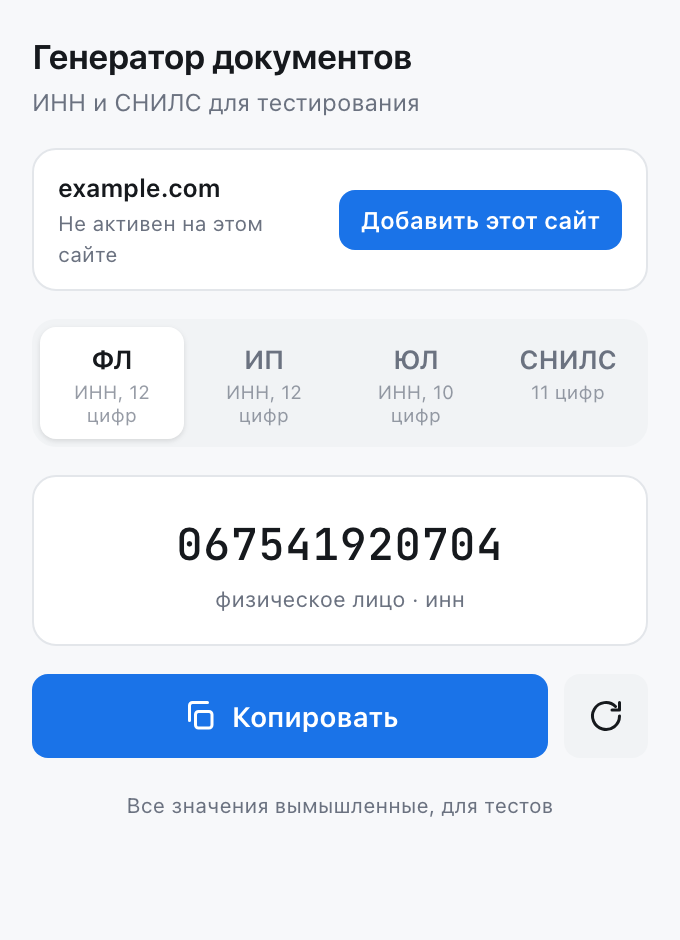
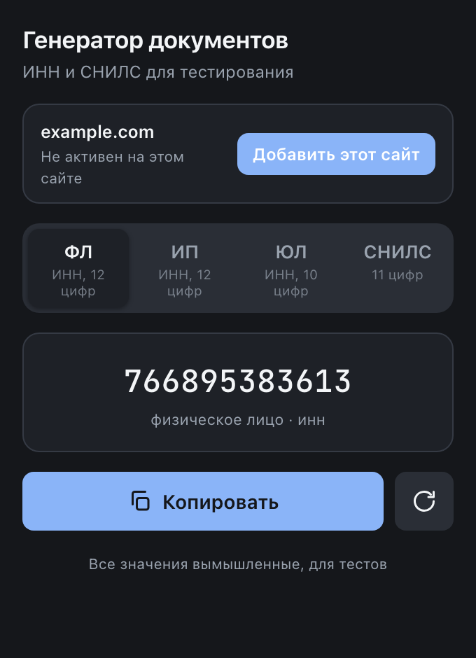
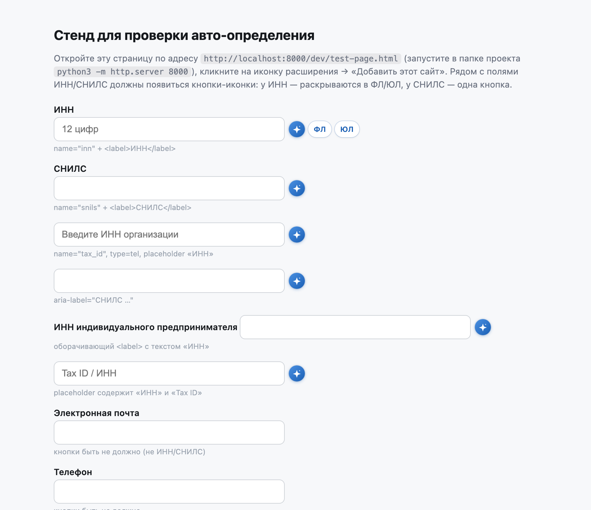

<div align="center">

# ИНН / СНИЛС генератор

**Расширение для Chrome: валидные тестовые реквизиты — ИНН, СНИЛС, банковские счета, ФИО и адреса**

[](https://developer.chrome.com/docs/extensions/develop/migrate)
[](LICENSE)
[](../../releases)

[Возможности](#возможности) · [Установка](#установка) · [Автозаполнение на сайтах](#автозаполнение-на-сайтах-opt-in) · [Приватность](#приватность) · [Разработка](#разработка)

</div>

---

Генерирует **корректные** тестовые значения: номера ИНН (физлица, ИП, юрлица) и СНИЛС
с контрольными числами по методике ФНС и ПФР, а также полный набор реквизитов — ОГРН,
ОГРНИП, КПП, БИК, ОКПО, расчётные и корреспондентские счета (контрольный ключ по
методике ЦБ РФ), ФИО, адреса, телефоны и e-mail. Значения выглядят настоящими и
проходят проверку валидаторов, но остаются вымышленными: они подходят для
**тестирования** форм, вёрстки, демонстраций и плейсхолдеров — и не принадлежат
реальным людям или организациям.

| Светлая тема | Тёмная тема |
|:---:|:---:|
|  |  |

## Возможности

**Генератор в popup:**
- **ИНН физического лица** — 12 цифр, валидный по методике ФНС
- **ИНН индивидуального предпринимателя** — 12 цифр (тот же формат, что у ФЛ)
- **ИНН юридического лица** — 10 цифр
- **СНИЛС** — 11 цифр в формате `XXX-XXX-XXX YY`
- Копирование в один клик, случайный регион РФ в первых двух цифрах ИНН
- Тёмная тема — автоматически по системным настройкам
- Горячие клавиши: `R` — новое значение, `C` — копировать

**Автозаполнение на сайтах (opt-in):**
- Расширение само находит поля — по `name`, `id`, `placeholder`, `aria-label`,
  `autocomplete` и тексту связанного `<label>`
- **Банковские реквизиты:** БИК, расчётный и корреспондентский счёт (20 цифр с
  контрольным ключом по БИК), ИНН/КПП банка, название банка, а также ОГРН, ОГРНИП,
  КПП, ОКПО, ОКТМО, ОКВЭД, наименование организации, сайт
  (`https://vektor-plyus.ru`, домен согласован с наименованием организации),
  поле «ИНН/КПП» одной строкой
- **Персональные данные:** ФИО, фамилия, имя, отчество, СНИЛС, паспорт (серия,
  номер), телефон, e-mail (домены `example.com` — письма не уйдут реальным адресатам)
- **Адрес:** индекс, регион, город, улица, дом, квартира и полный адрес
- **«Заполнить все» одной кнопкой:** в углу страницы появляется плавающая кнопка
  со счётчиком найденных полей — один клик заполняет их все согласованными
  значениями. Для полей ИНН формат выбирается по контексту формы: если на
  странице есть реквизиты организации (ОГРН, БИК, счёт) — подставляется ИНН
  юрлица, иначе физлица
- **Свои поля для нераспознанных форм:** кнопка «+» рядом с «Заполнить все»
  открывает режим выбора — кликните по любому полю и укажите, чем его
  заполнять: одним из 30+ готовых типов или **собственным скриптом**.
  Правило привязывается к сайту и CSS-селектору и работает как родное:
  у поля появляется кнопка «Заполнить», поле включается в «Заполнить все»
- Рядом с полем появляется компактная кнопка-иконка; при наведении или фокусе
  она раскрывается в пилюлю **«Заполнить»**. У поля ИНН — выбор **ФЛ** (12 цифр)
  или **ЮЛ** (10 цифр)
- Значения на странице **согласованы**: одна страница = одно лицо, одна
  организация, один банк, один адрес (регион ИНН совпадает с КПП и индексом,
  к/с и р/с проходят ключевание по одному БИК). Перезагрузите страницу, чтобы
  получить новый набор
- Поля банковских карт не трогаем; вставка совместима с React/Vue/Angular
  (нативный setter + события); новые поля в динамических SPA подхватываются
  автоматически, включая iframe на добавленном домене

## Установка

### Из исходников

1. Скачайте и распакуйте репозиторий (или склонируйте: `git clone`)
2. Откройте `chrome://extensions`
3. Включите **Режим разработчика** (справа вверху)
4. Нажмите **Распаковать расширение** и выберите папку проекта
5. Закрепите иконку на панели — клик открывает генератор

### Готовым пакетом из релизов

На странице [Releases](../../releases) скачайте `inn-snils-generator-v1.3.0.zip`,
распакуйте и подключите папку так же, как в пунктах 2–5 выше.

## Автозаполнение на сайтах (opt-in)

По умолчанию расширение **не работает ни на одном сайте** — и не запрашивает
доступ ни к одному сайту. Включается вручную, для каждого сайта отдельно:

1. Откройте нужный сайт и кликните на иконку расширения
2. В popup нажмите **«Добавить этот сайт»**
3. Chrome запросит разрешение **только для этого домена** — подтвердите

После подтверждения сайт добавляется **всегда автоматически** (даже если popup
успел закрыться) и расширение сразу начинает работать на открытой странице,
не дожидаясь перезагрузки. Рядом с распознанными полями появляются кнопки
«Заполнить»:



Список добавленных сайтов хранится локально. Любой сайт можно убрать кнопкой
**«Удалить этот сайт»** в popup.

### Свои поля и скрипты

Если расширение не распознало поле (например, «Логин» или «Код приглашения»):

1. Нажмите **«+»** рядом с кнопкой «Заполнить все»
2. Кликните по нужному полю (`<input>` или `<textarea>`) — откроется диалог настройки
3. Выберите готовый тип данных (ИНН, БИК, e-mail, город и т.д.) или пункт
   **«Свой скрипт…»**
4. Для скрипта напишите тело функции и нажмите **«Проверить»**, чтобы увидеть
   результат до сохранения

Скрипту доступны: `ctx.host`, `ctx.selector`, `ctx.field` (`id`, `name`,
`placeholder`, `value`) и объект `RusID` со всеми генераторами расширения
(например, `RusID.fill('bik')`). Верните значение через `return`:

```js
// Логин вида tester_482
return "tester_" + Math.floor(Math.random() * 1000);

// Серия + случайный счёт по БИК из профиля страницы
return ctx.field.name + "-" + RusID.fill("rs");
```

Правила привязаны к домену и CSS-селектору (селектор генерируется автоматически:
`#id`, `[name=…]` или nth-of-type-путь — и правится вручную). Повторный клик
«+» по настроенному полю открывает правило на редактирование или удаление.

Скрипты выполняются в изолированном мире расширения на добавленных вами
сайтах. Если CSP страницы запрещает динамическую компиляцию — диалог честно
предупредит и предложит выбрать готовый тип. Скрипты не имеют доступа к API
расширений, только к `ctx` и `RusID`.

## Приватность

- **Ноль host-разрешений по умолчанию** — расширение не имеет доступа к сайтам,
  пока вы сами не добавите конкретный домен
- **Не собирает, не хранит и не передаёт** никакие данные; локально сохраняется
  только список добавленных вами сайтов
- Нет аналитики и обращений к сети — расширение работает полностью офлайн

Полный текст — в [PRIVACY.md](PRIVACY.md).

## Разработка

Всё расширение — vanilla JS без зависимостей и сборки. Проверка корректности
контрольных чисел (самопроверка на 10 000 значений каждого типа):

```bash
node -e "console.log(require('./lib/generators.js').selfTest(10000))"
```

Проверить автозаполнение полей можно на локальной странице `dev/test-page.html`.

Сборка чистого zip для Chrome Web Store:

```bash
./package.sh
```

### Структура проекта

```
├── manifest.json          # манифест MV3
├── lib/
│   ├── data.js            # датасеты: ФИО, города, улицы, банки (UMD)
│   └── generators.js      # генерация + валидация реквизитов, профиль страницы (UMD)
├── background/
│   └── sw.js              # белый список сайтов, регистрация content-скрипта
├── content/
│   ├── content.js         # авто-определение полей, чипы, вставка
│   └── content.css        # стили чипа + анимация раскрытия
├── popup/
│   ├── popup.html         # разметка
│   ├── popup.css          # стили (с тёмной темой)
│   └── popup.js           # логика popup + управление сайтом
├── dev/                   # тестовые страницы для локальной проверки
├── icons/                 # иконки 16/48/128 + промо-tile
└── store-assets/          # скриншоты для README и магазина
```

## Отказ от ответственности

Сгенерированные значения вымышлены и предназначены исключительно для тестирования.
Не используйте их в официальных документах и реальных сервисах.

<details>
<summary><b>English</b></summary>

Chrome extension (MV3) that generates **valid-looking test values**: Russian
taxpayer IDs (INN), insurance account numbers (SNILS), company registration
numbers (OGRN/OGRNIP, KPP, OKPO), bank details (BIK, settlement and
correspondent accounts with a Central-Bank-style check key), Russian names,
addresses, phones and e-mails. All checksums are computed per official methods;
all values are fictional and meant for testing forms and layouts only.

Optional opt-in autofill: add a specific site from the popup, and the extension
detects known field types there (by name, label, placeholder and other
attributes) and offers a one-click «Заполнить» button next to them. Values are
consistent across the page (one person, one company, one bank). A floating
button fills every detected field at once, and a «+» picker lets you teach the
extension unrecognized fields — with a built-in data type or your own script
(runner provides field context and the extension's generators). Zero host
permissions by default; no data collection, fully offline.

</details>

## Лицензия

[MIT](LICENSE)
